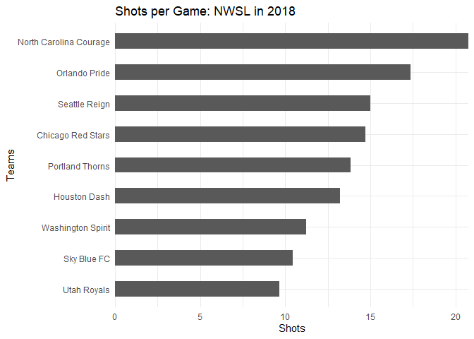

# Overview
> Reference & Data Source

* [StatsBombR](https://github.com/mhwangbo11/StatsBombR)
* [Accessing and Working with StatsBomb data in R](http://statsbomb.com/wp-content/uploads/2019/12/Using-StatsBomb-Data-In-R.pdf)

# Step 1: Loading packages

```r
library(tidyverse)  # Data Transformation/integration package
library(StatsBombR) # StatsBombR OpenSource data set
library(grid)       # Grid graphics package
library(ggplot2)    # Data visualization package
library(flextable)  # Table rendering package
```

# Step 2: Loading data set

```r
Comp <- FreeCompetitions() %>% 
  filter(competition_id==49) # United States the National Women's Soccer League (2018)
Matches <- FreeMatches(Comp) # Calling all NWSL match data in 2018
SBD <- StatsBombFreeEvents(MatchesDF = Matches, Parallel = T) # Creating a data frame
SBD = allclean(SBD) # Extracting everything including x/y coordinates
```

# Step 3: Exploratory Data Analysis (*EDA*)
## Case 1: Goals and Shots

```r
shots_goals = SBD %>%
 group_by(team.name) %>%
  summarise(shots = sum(type.name=="Shot", na.rm = TRUE)/n_distinct(match_id), goals = sum(shot.outcome.name=="Goal", na.rm = TRUE)/n_distinct(match_id)) # Dividing the number of shots/goals by each distinct (or unique) instance of a match, for every team. i.e. dividing the numbers per game.
```


```r
shots_goals
```

```
## # A tibble: 9 x 3
##   team.name              shots goals
##   <chr>                  <dbl> <dbl>
## 1 Chicago Red Stars      14.7  1.57 
## 2 Houston Dash           13.2  1.4  
## 3 North Carolina Courage 20.8  2.31 
## 4 Orlando Pride          17.4  1.25 
## 5 Portland Thorns        13.9  2    
## 6 Seattle Reign          15    1.43 
## 7 Sky Blue FC            10.4  1    
## 8 Utah Royals             9.67 1.11 
## 9 Washington Spirit      11.2  0.333
```

## Case 2: Data to a Chart `Shots per game`

```r
ggplot(data = shots_goals, aes(x=reorder(team.name, shots), y=shots)) + 
         geom_bar(stat="identity", width = .5) + 
          labs(x="Teams", y= "Shots") +
          theme(axis.title.y = element_blank()) +
          scale_y_continuous(expand=c(0,0)) + 
          coord_flip() +
          ggtitle('Shots per Game: NWSL in 2018') +
          theme_minimal()
```

<!-- -->

## Case 3: Player Shots per 90 minutes

```r
player_shots = SBD %>%
 group_by(player.name, player.id) %>%
 summarise(shots = sum(type.name=="Shot", na.rm = TRUE)) # Step 1
player_minutes = get.minutesplayed(SBD) # Step 2
player_minutes = player_minutes %>%
 group_by(player.id) %>%
 summarise(minutes = sum(MinutesPlayed)) # Step 3 
player_shots = left_join(player_shots, player_minutes) # Step 4
player_shots = player_shots %>% mutate(nineties = minutes/90) # Step 5
player_shots = player_shots %>% mutate(shots_per90 = shots/nineties) # Step 6
player_shots <- player_shots %>% 
  filter(shots_per90 !=0) # Step 7: Filter shots_per90 = 0
player_shots <- player_shots %>% arrange(desc(shots_per90)) # Step 8: Rearrange data based on shots_per90
```


```r
flextable(
  head(player_shots, 10),
  col_keys = c("player.name", "shots", "minutes","shots_per90"))
```

<!--html_preserve--><div class="tabwid"><style>.cl-4c1e1a20{font-family:'Roboto';font-size:11px;font-weight:normal;font-style:normal;text-decoration:none;color:rgba(17, 17, 17, 1.00);background-color:transparent;}.cl-4c1e3e06{margin:0;text-align:left;border-bottom: 0 solid rgba(0, 0, 0, 1.00);border-top: 0 solid rgba(0, 0, 0, 1.00);border-left: 0 solid rgba(0, 0, 0, 1.00);border-right: 0 solid rgba(0, 0, 0, 1.00);padding-bottom:2px;padding-top:2px;padding-left:5px;padding-right:5px;line-height: 1.00;background-color:transparent;}.cl-4c1e3e2e{margin:0;text-align:right;border-bottom: 0 solid rgba(0, 0, 0, 1.00);border-top: 0 solid rgba(0, 0, 0, 1.00);border-left: 0 solid rgba(0, 0, 0, 1.00);border-right: 0 solid rgba(0, 0, 0, 1.00);padding-bottom:2px;padding-top:2px;padding-left:5px;padding-right:5px;line-height: 1.00;background-color:transparent;}.cl-4c1e78f8{width:54px;background-color:transparent;vertical-align: middle;border-bottom: 0 solid rgba(0, 0, 0, 1.00);border-top: 0 solid rgba(0, 0, 0, 1.00);border-left: 0 solid rgba(0, 0, 0, 1.00);border-right: 0 solid rgba(0, 0, 0, 1.00);margin-bottom:0;margin-top:0;margin-left:0;margin-right:0;}.cl-4c1e7916{width:54px;background-color:transparent;vertical-align: middle;border-bottom: 0 solid rgba(0, 0, 0, 1.00);border-top: 0 solid rgba(0, 0, 0, 1.00);border-left: 0 solid rgba(0, 0, 0, 1.00);border-right: 0 solid rgba(0, 0, 0, 1.00);margin-bottom:0;margin-top:0;margin-left:0;margin-right:0;}.cl-4c1e792a{width:54px;background-color:transparent;vertical-align: middle;border-bottom: 2.00px solid rgba(0, 0, 0, 1.00);border-top: 0 solid rgba(0, 0, 0, 1.00);border-left: 0 solid rgba(0, 0, 0, 1.00);border-right: 0 solid rgba(0, 0, 0, 1.00);margin-bottom:0;margin-top:0;margin-left:0;margin-right:0;}.cl-4c1e7934{width:54px;background-color:transparent;vertical-align: middle;border-bottom: 2.00px solid rgba(0, 0, 0, 1.00);border-top: 0 solid rgba(0, 0, 0, 1.00);border-left: 0 solid rgba(0, 0, 0, 1.00);border-right: 0 solid rgba(0, 0, 0, 1.00);margin-bottom:0;margin-top:0;margin-left:0;margin-right:0;}.cl-4c1e793e{width:54px;background-color:transparent;vertical-align: middle;border-bottom: 2.00px solid rgba(0, 0, 0, 1.00);border-top: 2.00px solid rgba(0, 0, 0, 1.00);border-left: 0 solid rgba(0, 0, 0, 1.00);border-right: 0 solid rgba(0, 0, 0, 1.00);margin-bottom:0;margin-top:0;margin-left:0;margin-right:0;}.cl-4c1e7948{width:54px;background-color:transparent;vertical-align: middle;border-bottom: 2.00px solid rgba(0, 0, 0, 1.00);border-top: 2.00px solid rgba(0, 0, 0, 1.00);border-left: 0 solid rgba(0, 0, 0, 1.00);border-right: 0 solid rgba(0, 0, 0, 1.00);margin-bottom:0;margin-top:0;margin-left:0;margin-right:0;}</style><table style='border-collapse:collapse;'><thead><tr style="overflow-wrap:break-word;"><td class="cl-4c1e7948"><p class="cl-4c1e3e06"><span class="cl-4c1e1a20">player.name</span></p></td><td class="cl-4c1e793e"><p class="cl-4c1e3e2e"><span class="cl-4c1e1a20">shots</span></p></td><td class="cl-4c1e793e"><p class="cl-4c1e3e2e"><span class="cl-4c1e1a20">minutes</span></p></td><td class="cl-4c1e793e"><p class="cl-4c1e3e2e"><span class="cl-4c1e1a20">shots_per90</span></p></td></tr></thead><tbody><tr style="overflow-wrap:break-word;"><td class="cl-4c1e78f8"><p class="cl-4c1e3e06"><span class="cl-4c1e1a20">Samantha Kerr</span></p></td><td class="cl-4c1e7916"><p class="cl-4c1e3e2e"><span class="cl-4c1e1a20">46</span></p></td><td class="cl-4c1e7916"><p class="cl-4c1e3e2e"><span class="cl-4c1e1a20">676.82845</span></p></td><td class="cl-4c1e7916"><p class="cl-4c1e3e2e"><span class="cl-4c1e1a20">6.116764</span></p></td></tr><tr style="overflow-wrap:break-word;"><td class="cl-4c1e78f8"><p class="cl-4c1e3e06"><span class="cl-4c1e1a20">Tyler Lussi</span></p></td><td class="cl-4c1e7916"><p class="cl-4c1e3e2e"><span class="cl-4c1e1a20">6</span></p></td><td class="cl-4c1e7916"><p class="cl-4c1e3e2e"><span class="cl-4c1e1a20">88.92315</span></p></td><td class="cl-4c1e7916"><p class="cl-4c1e3e2e"><span class="cl-4c1e1a20">6.072659</span></p></td></tr><tr style="overflow-wrap:break-word;"><td class="cl-4c1e78f8"><p class="cl-4c1e3e06"><span class="cl-4c1e1a20">Frannie Crouse</span></p></td><td class="cl-4c1e7916"><p class="cl-4c1e3e2e"><span class="cl-4c1e1a20">2</span></p></td><td class="cl-4c1e7916"><p class="cl-4c1e3e2e"><span class="cl-4c1e1a20">33.31467</span></p></td><td class="cl-4c1e7916"><p class="cl-4c1e3e2e"><span class="cl-4c1e1a20">5.403026</span></p></td></tr><tr style="overflow-wrap:break-word;"><td class="cl-4c1e78f8"><p class="cl-4c1e3e06"><span class="cl-4c1e1a20">Lynn Williams</span></p></td><td class="cl-4c1e7916"><p class="cl-4c1e3e2e"><span class="cl-4c1e1a20">51</span></p></td><td class="cl-4c1e7916"><p class="cl-4c1e3e2e"><span class="cl-4c1e1a20">868.64795</span></p></td><td class="cl-4c1e7916"><p class="cl-4c1e3e2e"><span class="cl-4c1e1a20">5.284074</span></p></td></tr><tr style="overflow-wrap:break-word;"><td class="cl-4c1e78f8"><p class="cl-4c1e3e06"><span class="cl-4c1e1a20">Thembi Kgatlana</span></p></td><td class="cl-4c1e7916"><p class="cl-4c1e3e2e"><span class="cl-4c1e1a20">5</span></p></td><td class="cl-4c1e7916"><p class="cl-4c1e3e2e"><span class="cl-4c1e1a20">89.08820</span></p></td><td class="cl-4c1e7916"><p class="cl-4c1e3e2e"><span class="cl-4c1e1a20">5.051174</span></p></td></tr><tr style="overflow-wrap:break-word;"><td class="cl-4c1e78f8"><p class="cl-4c1e3e06"><span class="cl-4c1e1a20">Caitlin Foord</span></p></td><td class="cl-4c1e7916"><p class="cl-4c1e3e2e"><span class="cl-4c1e1a20">2</span></p></td><td class="cl-4c1e7916"><p class="cl-4c1e3e2e"><span class="cl-4c1e1a20">37.56095</span></p></td><td class="cl-4c1e7916"><p class="cl-4c1e3e2e"><span class="cl-4c1e1a20">4.792211</span></p></td></tr><tr style="overflow-wrap:break-word;"><td class="cl-4c1e78f8"><p class="cl-4c1e3e06"><span class="cl-4c1e1a20">Camila Martins Pereira</span></p></td><td class="cl-4c1e7916"><p class="cl-4c1e3e2e"><span class="cl-4c1e1a20">9</span></p></td><td class="cl-4c1e7916"><p class="cl-4c1e3e2e"><span class="cl-4c1e1a20">179.51085</span></p></td><td class="cl-4c1e7916"><p class="cl-4c1e3e2e"><span class="cl-4c1e1a20">4.512262</span></p></td></tr><tr style="overflow-wrap:break-word;"><td class="cl-4c1e78f8"><p class="cl-4c1e3e06"><span class="cl-4c1e1a20">Sydney Leroux</span></p></td><td class="cl-4c1e7916"><p class="cl-4c1e3e2e"><span class="cl-4c1e1a20">20</span></p></td><td class="cl-4c1e7916"><p class="cl-4c1e3e2e"><span class="cl-4c1e1a20">416.31365</span></p></td><td class="cl-4c1e7916"><p class="cl-4c1e3e2e"><span class="cl-4c1e1a20">4.323663</span></p></td></tr><tr style="overflow-wrap:break-word;"><td class="cl-4c1e78f8"><p class="cl-4c1e3e06"><span class="cl-4c1e1a20">Michaela Abam</span></p></td><td class="cl-4c1e7916"><p class="cl-4c1e3e2e"><span class="cl-4c1e1a20">1</span></p></td><td class="cl-4c1e7916"><p class="cl-4c1e3e2e"><span class="cl-4c1e1a20">22.08992</span></p></td><td class="cl-4c1e7916"><p class="cl-4c1e3e2e"><span class="cl-4c1e1a20">4.074257</span></p></td></tr><tr style="overflow-wrap:break-word;"><td class="cl-4c1e7934"><p class="cl-4c1e3e06"><span class="cl-4c1e1a20">Marta Vieira da Silva</span></p></td><td class="cl-4c1e792a"><p class="cl-4c1e3e2e"><span class="cl-4c1e1a20">25</span></p></td><td class="cl-4c1e792a"><p class="cl-4c1e3e2e"><span class="cl-4c1e1a20">573.60513</span></p></td><td class="cl-4c1e792a"><p class="cl-4c1e3e2e"><span class="cl-4c1e1a20">3.922559</span></p></td></tr></tbody></table></div><!--/html_preserve-->

## Case 4: Coming Soon
